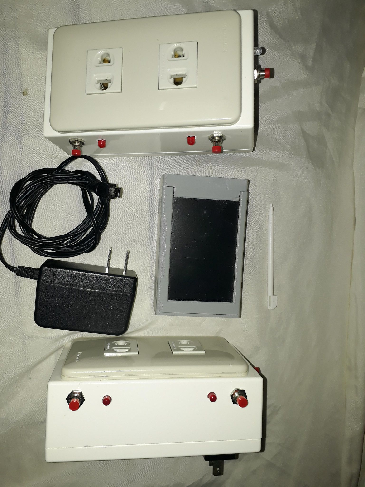
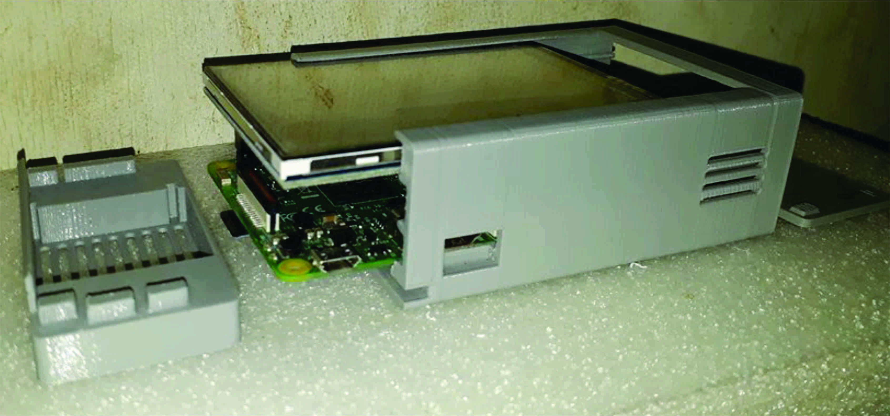
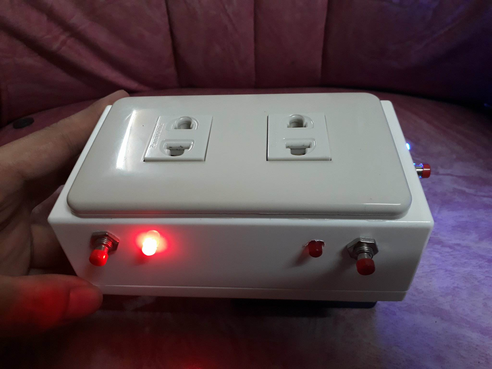
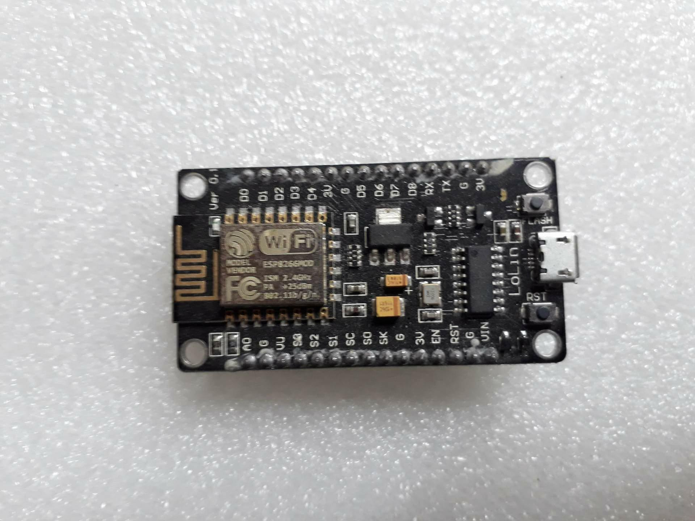

<div class="ui small rounded images">
  
  
  
  
</div>

This project was focused on making a wireless portable control system that can control the wireless device outdoor by logging in the end-user account on the website in any web browser via internet connection. It can also control the lighting and appliances on and off wirelessly and provision for additional controlled switch. The wireless device can handle appliances such as Television, Electric Fan, Flat Iron, Top-mount Refrigerator and other appliances that are low to medium powered.

For this project, I was the lead programmer who was responsible for the software side of the project. From installing raspian OS to developing its GUI in python tkinter, creating the CentOS server droplet in digital ocean to developing it to a web server that is running in python flask, and developing the program of ESP8266 via arduino IDE


Web Server, Controller(Raspberry PI) and the Outlet itself can toggle switching ON and OFF state of the outlet. Data are stored in a database and shared as an API. Here is some example of the code of the devices sending data.

DEVICE(ESP8266)
```js
void update_send_to_server(String switch_position, boolean switch_status){
  StaticJsonBuffer<300> JSONbuffer;
  JsonObject& JSONencoder = JSONbuffer.createObject();
  JSONencoder["switch_position"] = switch_position;
  JSONencoder["device_name"] = DeviceID;
  JSONencoder["switch_status"] = switch_status;
  char JSONmessageBuffer[300];
  JSONencoder.prettyPrintTo(JSONmessageBuffer, sizeof(JSONmessageBuffer));
  Serial.println(JSONmessageBuffer);
  HTTPClient http;
  http.begin("http://" + eepromIP +"/switchhttp");
  http.addHeader("Content-Type", "application/json");
  int httpCode = http.POST(JSONmessageBuffer); 
  String payload = http.getString(); 
  http.end(); 
}
```

CONTROLLER(Rasberry PI)

```js
def postServer(device_name, switch_position, value, server_ip, timeout_delay):
    if value == 1: #
        newValue = "ON"
    elif value == 0:
        newValue = "OFF"
    request_query = 'http://' + server_ip + '/postupdate'
    payload = {'device_name': device_name, 'switch_position':switch_position, 'status': newValue}
    req = requests.post(request_query,payload,timeout=timeout_delay)

def postSwitch(ip_address, switch_position, value, server_ip, timeout_delay):
    if value == 1: #
        newValue = "true"
    elif value == 0:
        newValue = "false"
    if switch_position == 1:
        switch_type = "Switch1"
    elif switch_position == 2:
        switch_type = "Switch2"
    try:
        request_query = "http://" + ip_address + "/query?" + switch_type + "=" + newValue
        print(request_query)
        req = requests.post(request_query, timeout=timeout_delay)
    except Exception as e:
        print('errorT:', e)
```

WEB SERVER
```js
@app.route('/postupdate', methods=['POST','GET'])
def postupdate():
    if request.method == 'POST':
        device_name = request.form['device_name']
        switch_position = request.form['switch_position']
        status = request.form['status']
        if switch_position == "1":
            if status == "ON":
                query = "UPDATE devices SET switchOneStatus = 0 WHERE deviceName = \"" + device_name + "\";"
            elif status == "OFF":
                query = "UPDATE devices SET switchOneStatus = 1 WHERE deviceName = \"" + device_name + "\";"
        elif switch_position == "2":
            if status == "ON":
                query = "UPDATE devices SET switchTwoStatus = 0 WHERE deviceName = \"" + device_name + "\";"
            elif status == "OFF":
                query = "UPDATE devices SET switchTwoStatus = 1 WHERE deviceName = \"" + device_name + "\";"
        
        conn = MySQLdb.connect(host="localhost",user="root",passwd="Password123!", db="myflaskapp")
        c = conn.cursor()   
        result = c.execute(query)
        conn.commit()
        conn.close()
        c.close()
        if result > 0:
            return 'done'
        else:
            return 'error'
```

You can see how it works [here](https://www.youtube.com/watch?v=_NttntY7BJg).

You can see the full source code [here](https://github.com/jdbalgos/portable-home-control-system).

