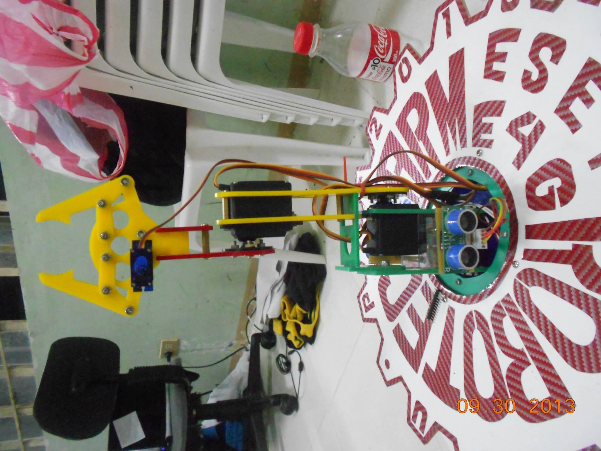

This project is a simple robotic arm devices consisted of servo motors, HC-SR04 Ultrasonic sensor and PIC16F877A programmable IC. I was the only programmer at the time as i am the only one that who can(or willing to) program the IC.

Source Video: <a href="https://www.youtube.com/watch?v=gvVa_2aoiX4"><i class="large youtube icon"></i></a>

Source Code: <a href="https://github.com/jdbalgos/robotic-arm"><i class="large github icon"></i></a>
